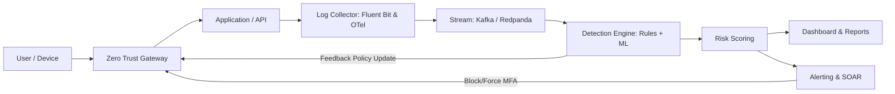

# AegisZT – Adaptive Zero-Trust Security Monitoring Platform

> **Adaptive Cyber Defense**: รวมพลัง **Zero Trust Access Control** + **Mini-SIEM Monitoring**  
> ป้องกัน, ตรวจจับ, และตอบสนองภัยไซเบอร์แบบครบวงจร อิงตาม **OWASP Top Ten Threats**

---

## 🚀 Features
- **Zero Trust Gateway**
  - รองรับ MFA / WebAuthn / RBAC / ABAC
  - Policy Engine ด้วย OPA/Rego
  - WAF (Coraza/OWASP CRS) + Rate limiting

- **Security Monitoring (Mini-SIEM)**
  - Collector รองรับ Fluent Bit / OpenTelemetry
  - Analyzer: Rule-based (Sigma) + ML-based (IsolationForest, XGBoost)
  - Risk Scoring ตาม Severity × Confidence × Asset value
  - Mapping กับ **OWASP Top Ten** + **MITRE ATT&CK**

- **Dashboard & Alerting**
  - Realtime Dashboard (Next.js + Tailwind + Grafana)
  - Export PDF/Excel สำหรับผู้บริหาร
  - Alert ผ่าน Slack / LINE Notify / Email
  - Incident Response: ปุ่ม “Respond” → Block IP / Force MFA / Revoke token

- **Adaptive Feedback Loop**
  - Mini-SIEM วิเคราะห์ log → ส่ง feedback ไปอัปเดต Policy Zero Trust
  - ทำให้ระบบเป็น **Dynamic & Adaptive Security**

---

## 🏗 System Architecture


---

## 📂 Repository Structure
```
aegiszt/
  apps/
    gateway/            # Zero Trust Gateway configs (Kong/Envoy, WAF)
    idp/                # Keycloak realms/exports
    ingestion-api/      # FastAPI service for log ingestion
    rule-engine/        # Sigma rules + Rego policies
    ml-detector/        # ML models (IsolationForest, XGBoost)
    ui-dashboard/       # Next.js dashboard
    soar/               # SOAR playbooks (n8n/StackStorm)
  infra/
    k8s/                # Helm charts, manifests
    terraform/          # Infrastructure as Code
  data/
    demo/               # Attack simulation scripts + sample logs
    notebooks/          # Jupyter notebooks for model training
  docs/
    README.md
    ARCHITECTURE.md
    DEMO_SCRIPT.md
    RUNBOOK.md
    SECURITY.md
```

---

## ⚡ Demo Script (Storyline)
1. User login จากกรุงเทพ → ผ่าน MFA → ปกติ  
2. Hacker ยิง Brute Force → Zero Trust rate-limit + SIEM แจ้งเตือน  
3. Hacker ยิง SQLi → WAF ปล่อย แต่ SIEM detect → Alert  
4. SOAR Respond: Block IP + Force MFA + Jira ticket  
5. Feedback Loop → Update Zero Trust Policy (เพิ่ม strict rule)  
6. Export PDF report → สรุปเหตุการณ์พร้อม Evidence

---

## 🛠 Tech Stack
- **Zero Trust**: Keycloak, OPA/Rego, Kong/Envoy, Coraza (OWASP CRS)  
- **Ingestion**: Fluent Bit, OpenTelemetry, FastAPI  
- **Stream/Queue**: Kafka / Redpanda  
- **Storage**: ClickHouse / OpenSearch, PostgreSQL, MinIO/S3  
- **Detection**: Sigma Rules, scikit-learn, XGBoost, Feast  
- **Dashboard**: Next.js + Tailwind, Grafana  
- **Alerting/SOAR**: Slack, LINE Notify, Email, n8n/StackStorm  
- **Infra**: Kubernetes, Helm, Terraform, Vault, Prometheus, Loki

---

## 🚦 Getting Started

### Prerequisites
- Docker / Kubernetes (K3s, Minikube, or cloud)
- Helm
- Python 3.10+
- Node.js 18+

### Quick Start
```bash
# 1. Clone repo
git clone https://github.com/your-org/aegiszt.git
cd aegiszt

# 2. Deploy with Helm
helm install aegiszt ./infra/k8s

# 3. Access dashboard
http://localhost:3000
```

### Simulate Attack
```bash
# SQL Injection attack demo
python data/demo/sql_injection.py
```

---

## 📊 Roadmap
- [x] MVP: Collector + Rule Engine + Dashboard  
- [x] Brute Force / SQL Injection detection  
- [ ] Feedback loop → auto update Zero Trust policies  
- [ ] ML anomaly detection (IsolationForest baseline)  
- [ ] SOAR playbooks (auto-block, auto-MFA)  
- [ ] Enterprise package (multi-AZ, PDPA/GDPR compliance)

---

## 📜 License
> Proprietary – สำหรับการศึกษา/งานวิจัย  
> Commercial licensing available upon request  

---

## 👨‍💻 Authors
- **Thirapong Pinkaew** – Project Lead / Dev+Cyber Research  
- Advisor: [อาจารย์/ภาควิชา]  
